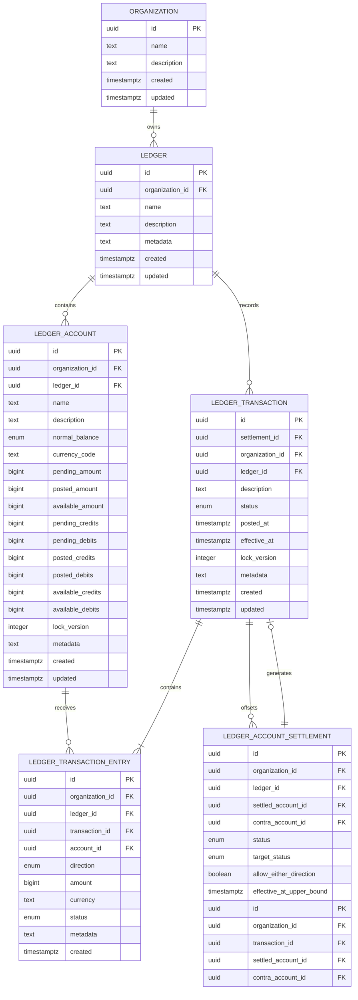

# Exchequer Ledger API entity relationships

This diagram shows the ownership and accounting columns used by Ledger Transactions. See
[`schema.ts`](../../src/db/schema.ts) for the complete database schema.

## Transaction invariants

- A Transaction belongs to one Organization and Ledger. The composite foreign key
  `(organization_id, ledger_id)` references its Ledger.
- An Entry repeats `organization_id` and `ledger_id` so composite foreign keys require its
  Transaction and Account to share both owners.
- Transaction status is `pending`, `posted`, or `voided`. `posted_at` exists only for Posted
  Transactions. Entries inherit their Transaction's `effective_at`; live balances depend on status.
- Entries store the Transaction status and the request Currency Code alongside the Amount. Currency
  exponent handling is deferred until the Asset model exists.
- Entry Amounts are positive integer Minor Units no greater than JavaScript's maximum safe integer.
- Each Account stores pending, posted, and available Amounts plus credit and debit counters for each
  state. All nine projections are safe integers.
- Transaction lists use `(ledger_id, created DESC, id DESC)`. Ownership and lookup indexes cover
  Organization, status, Transaction, and Account access paths.

Settlement Transactions carry a nullable, unique `settlement_id`. Its composite foreign key requires
matching Organization and Ledger ownership. Settlement responses derive Amount and direction from
the generated Entry; Settlements store neither an Amount nor a Transaction reference. Processing
records the intended target while accounting and finalization commit in separate repository-owned
transactions. Source membership is frozen during Processing and released when voiding is finalized.

Mutation idempotency uses Valkey, scoped by Organization, action and client key. Use a fresh UUID
for each new action and reuse it only for retries. Claims store resource IDs for 15 minutes. Pending
claims receive a bounded wait followed by retryable 409; unavailable storage returns 503. Domain
services explicitly claim, execute or replay, and complete or release; the idempotency service does
not execute business operations.
