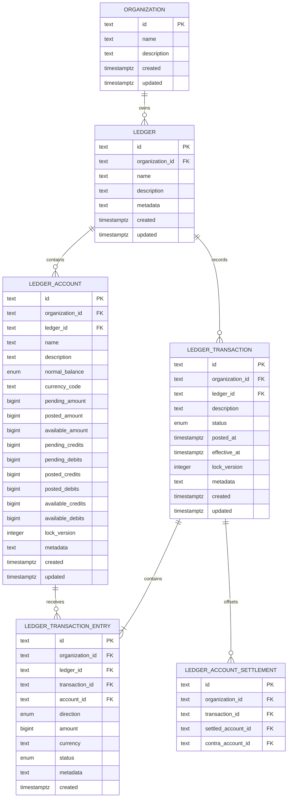

# Exchequer Ledger API entity relationships

This diagram shows the ownership and accounting columns used by Ledger Transactions. See
[`schema.ts`](../../src/repo/schema.ts) for the complete database schema.

## Transaction invariants

- A Transaction belongs to one Organization and Ledger. The composite foreign key
  `(organization_id, ledger_id)` references its Ledger.
- An Entry repeats `organization_id` and `ledger_id` so composite foreign keys require its
  Transaction and Account to share both owners.
- Transaction status is `pending`, `posted`, or `voided`. `posted_at` exists only for Posted
  Transactions. Entries inherit their Transaction's `effective_at`; live balances depend on status.
- Entries store the Transaction status and the request Currency Code alongside the Amount. Currency
  exponent handling is deferred until the Asset model exists.
- Entry Amounts are positive integer Minor Units no greater than JavaScript's maximum safe integer.
- Each Account stores pending, posted, and available Amounts plus credit and debit counters for each
  state. All nine projections are safe integers.
- Transaction lists use `(ledger_id, created DESC, id DESC)`. Ownership and lookup indexes cover
  Organization, status, Transaction, and Account access paths.

Create idempotency uses Valkey only. The Organization-scoped key maps to the server-owned
Transaction ID for 15 minutes. A losing caller waits up to two seconds for that Transaction to
appear and receives a retryable `503` if the winning request is still unresolved.
