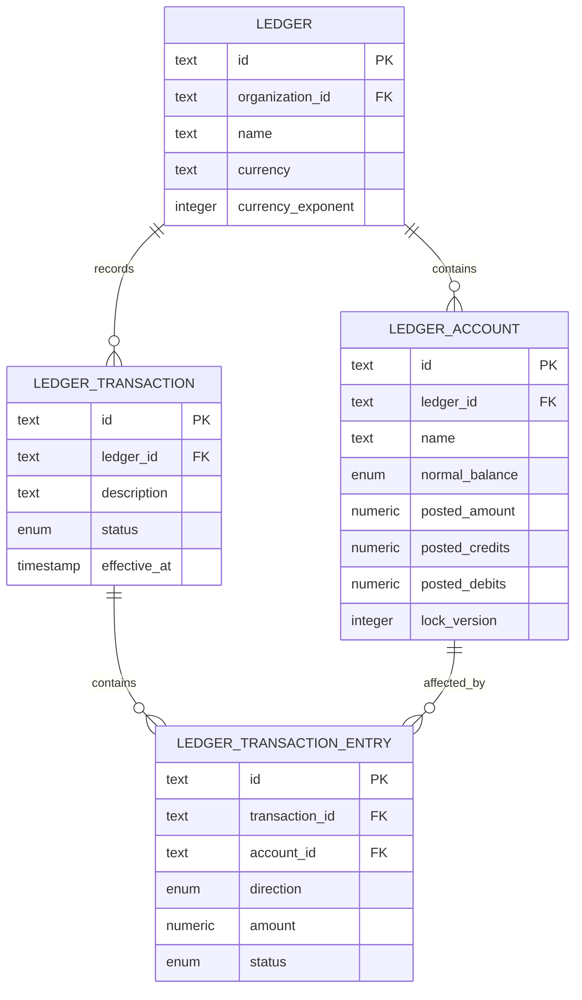
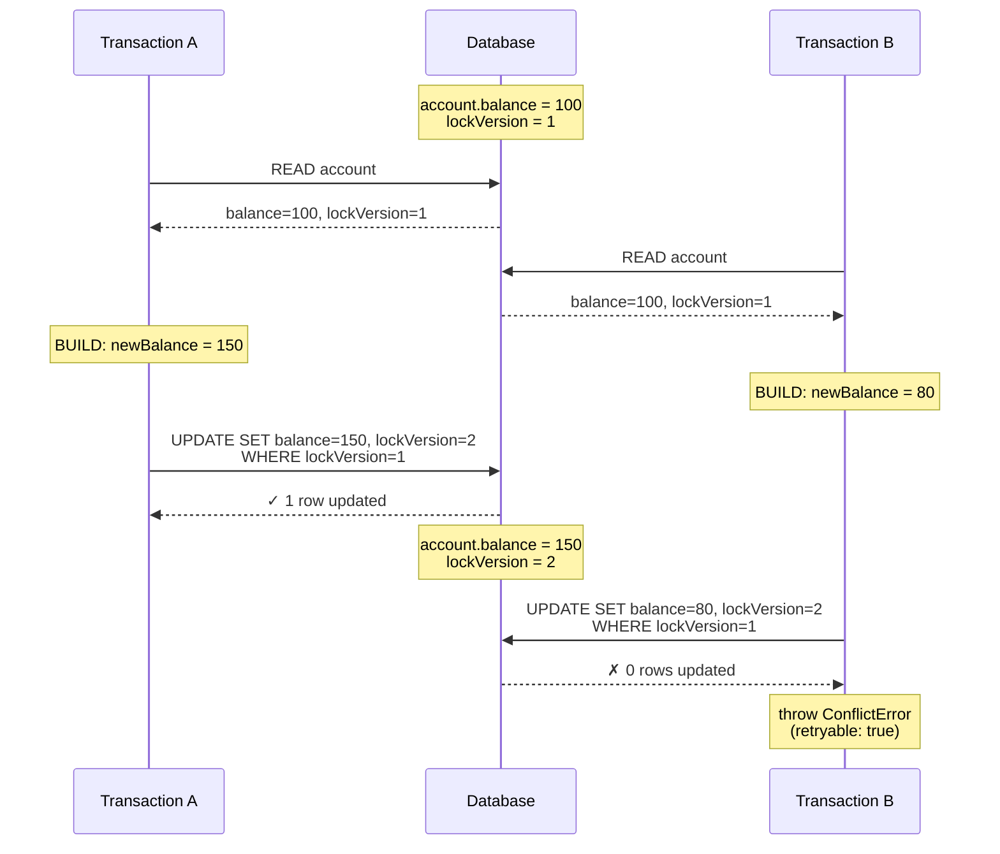

# Optimistic Locking in a Double-Entry Ledger

Ledgers are a deceptively simple problem to tackle. At a certain scale, leveraging a simple `SELECT FOR UPDATE` works perfectly well—wrap everything in a transaction, and move on.

But the moment you need concurrent writes to the same accounts, hundreds of transactions per second, and real-time balance consistency—everything changes. Suddenly, pessimistic locking becomes your bottleneck. Every read blocks, every write queues, and your payment API starts timing out under load.

This is where you need to change your approach. No amount of hardware will fix hot accounts, you can't scale around a single row being locked. *Optimistic locking* lets you maintain double-entry bookkeeping invariants and real-time account balances without holding locks during reads.

- [The Problem with Pessimistic Locking in SQL](#the-problem-with-pessimistic-locking-in-sql)
- [The Three-Phase Transaction Pattern](#the-three-phase-transaction-pattern)
- [Optimistic Locking Deep Dive](#optimistic-locking-deep-dive)
- [Error Handling & Retry Strategy](#error-handling--retry-strategy)
- [Idempotency & Safety](#idempotency--safety)
- [Performance: Real Benchmark Results](#performance-real-benchmark-results)
- [Edge Cases & Gotchas](#edge-cases--gotchas)
- [Conclusion](#conclusion)

## The Problem with Pessimistic Locking in SQL

Building a financial ledger for Payment Service Providers (PSPs) and marketplaces presents a unique challenge: you need to process thousands of transactions per second while maintaining **atomic balance updates** and **double-entry bookkeeping invariants** (debits must equal credits).

The traditional approach uses pessimistic locking:

```sql
BEGIN;
SELECT * FROM accounts WHERE id IN (...) FOR UPDATE;  -- Acquires row-level locks
UPDATE accounts SET balance = ... WHERE id = ...;
COMMIT;
```

This works, but has a critical flaw in high-throughput systems.

### A Note on Locking and Isolation (PostgreSQL)

In PostgreSQL's default `READ COMMITTED` isolation, `SELECT FOR UPDATE` doesn't block *all* readers—plain `SELECT` statements can still read committed data. What it blocks are **other transactions attempting to lock the same rows** (via `FOR UPDATE`, `FOR SHARE`, or `UPDATE`/`DELETE`).

But in a ledger system, this distinction matters less than you'd think. Every transaction needs consistent balance data to calculate the next write. The moment Transaction B reads an account balance that Transaction A is about to modify, B's calculation becomes stale—whether you block that read or not.

*The question:* Can we maintain consistency without holding locks during reads?

The answer is *optimistic concurrency control* (OCC)—a pattern that assumes conflicts are rare and only checks for them at write time.

As Marc Brooker [observes](https://brooker.co.za/blog/2024/12/17/occ-and-isolation.html), OCC allows systems to "avoid all coordination during the process of executing a transaction, and only coordinate at `COMMIT` time." This is precisely what our three-phase pattern achieves: we defer all synchronization to the final write phase, checking for conflicts via the `lockVersion` column.

The tradeoff is retry cost when conflicts occur—but in OLTP workloads where read sets are typically much larger than write sets, optimistic approaches often win.

## Data Model

Before diving into the implementation, here's the database schema that supports our ledger system:



### Key relationships

- Each **transaction** contains 2+ **entries** (one debit, one credit minimum for double-entry)
- Each **entry** affects an **account** balance
- The `lock_version` field on accounts is critical—it's the mechanism that makes optimistic locking work

> Note that only `LEDGER_ACCOUNT` has a `lock_version` field. Transactions and entries are immutable (append-only), so they don't need concurrency control. The contention point is account balances, which are updated frequently.

## The Three-Phase Transaction Pattern

The core of our optimistic locking approach is this pattern:

```
1. READ: Fetch all affected accounts (no locks held)
2. VALIDATE & BUILD: Calculate balance updates in-memory
3. WRITE: Execute batched writes in single database transaction
```

Let's walk through the implementation:

### Phase 1: READ - Fetch Accounts Without Locks ([source](https://github.com/martinffx/exchequerio/blob/main/apps/api/src/repo/LedgerTransactionRepo.ts#L165))

```typescript
public async createTransaction(
  transaction: LedgerTransactionEntity
): Promise<LedgerTransactionEntity> {
  // 1. Fetch all ledger accounts (NO LOCKS - other transactions can read concurrently)
  const accountIds = transaction.entries.map(e => e.accountId.toString());
  const accounts = await this.db
    .select()
    .from(LedgerAccountsTable)
    .where(and(inArray(LedgerAccountsTable.id, accountIds)));
```

> **Critical:** This is a plain `SELECT`, not `SELECT FOR UPDATE`. Other transactions can read and write these accounts concurrently.

### Phase 2: VALIDATE & BUILD - Calculate Balances In-Memory ([source](https://github.com/martinffx/exchequerio/blob/main/apps/api/src/repo/LedgerTransactionRepo.ts#L165))

```typescript
  // 2. Update balances In-memory
  const ledgerAccountsById = new Map(
    accounts.map(a => {
      const account = LedgerAccountEntity.fromRecord(a);
      return [account.id.toString(), account];
    })
  );

  const ledgerAccounts = transaction.entries.map(entry => {
    const account = ledgerAccountsById.get(entry.accountId.toString());
    if (account !== undefined) {
      return account.applyEntry(entry);  // Returns new immutable entity
    }
    throw new NotFoundError(
      `Missing Ledger Account ${entry.accountId.toString()}, for entry ${entry.id.toString()}`
    );
  });
```

The `applyEntry()` method implements double-entry accounting rules:

```typescript
public applyEntry(entry: { direction: "debit" | "credit"; amount: number }): LedgerAccountEntity {
  let newPostedAmount = this.postedAmount;
  let newPostedCredits = this.postedCredits;
  let newPostedDebits = this.postedDebits;

  // Apply double-entry accounting rules based on account's normal balance
  if (this.normalBalance === "debit") {
    if (entry.direction === "debit") {
      // Debit increases debit accounts (Assets, Expenses)
      newPostedAmount += entry.amount;
      newPostedDebits += entry.amount;
    } else {
      // Credit decreases debit accounts
      newPostedAmount -= entry.amount;
      newPostedCredits += entry.amount;
    }
  } else {
    // credit normal balance (Liabilities, Revenue)
    if (entry.direction === "credit") {
      // Credit increases credit accounts
      newPostedAmount += entry.amount;
      newPostedCredits += entry.amount;
    } else {
      // Debit decreases credit accounts
      newPostedAmount -= entry.amount;
      newPostedDebits += entry.amount;
    }
  }

  // Return new immutable entity with updated balances
  return new LedgerAccountEntity({
    ...this,
    postedAmount: newPostedAmount,
    postedCredits: newPostedCredits,
    postedDebits: newPostedDebits,
    availableAmount: newPostedAmount,
    availableCredits: newPostedCredits,
    availableDebits: newPostedDebits,
    updated: new Date(),
  });
}
```

### Phase 3: WRITE - Atomic Transaction with Version Checks ([source](https://github.com/martinffx/exchequerio/blob/main/apps/api/src/repo/LedgerTransactionRepo.ts#L165))

```typescript
  // 3. Write all changes in a single DB transaction
  try {
    return await this.db.transaction(async tx => {
      // 3a. Insert transaction record FIRST (entries depend on it via FK)
      const transactionRecord = transaction.toRecord();
      const transactionResult = await tx
        .insert(LedgerTransactionsTable)
        .values(transactionRecord)
        .onConflictDoUpdate({
          target: LedgerTransactionsTable.id,
          set: {
            ledgerId: transactionRecord.ledgerId,
            organizationId: transactionRecord.organizationId,
            description: transactionRecord.description,
            status: transactionRecord.status,
            effectiveAt: transactionRecord.effectiveAt,
            metadata: transactionRecord.metadata,
            updated: transactionRecord.updated,
          },
        })
        .returning();

      // 3b. Insert all entries in batch (idempotent via upsert)
      const txEntriesPromises = transaction.entries.map(async entry => {
        const entryRecord = entry.toRecord();
        await tx
          .insert(LedgerTransactionEntriesTable)
          .values(entryRecord)
          .onConflictDoUpdate({
            target: LedgerTransactionEntriesTable.id,
            set: {
              transactionId: entryRecord.transactionId,
              accountId: entryRecord.accountId,
              organizationId: entryRecord.organizationId,
              direction: entryRecord.direction,
              amount: entryRecord.amount,
              currency: entryRecord.currency,
              currencyExponent: entryRecord.currencyExponent,
              status: entryRecord.status,
              metadata: entryRecord.metadata,
              updated: entryRecord.updated,
            },
          });
      });

      // 3c. Update all account balances in parallel with optimistic locking
      const ledgerAccountsPromises = ledgerAccounts.map(async account => {
        const result = await tx
          .update(LedgerAccountsTable)
          .set(account.toRecord())
          .where(
            and(
              eq(LedgerAccountsTable.id, account.id.toString()),
              eq(LedgerAccountsTable.lockVersion, account.lockVersion)  // <-- VERSION CHECK
            )
          )
          .returning();

        // No rows updated = optimistic lock failure
        if (result.length === 0) {
          throw new ConflictError({
            message: `Account ${account.id.toString()} was modified by another transaction`,
            retryable: true,  // <-- Signal client can retry
          });
        }

        // More than one row updated = data integrity bug
        if (result.length > 1) {
          throw new ConflictError({
            message: `Data integrity error: Updated ${result.length} rows for account ${account.id.toString()}, expected 1`,
          });
        }

        return LedgerAccountEntity.fromRecord(result[0]);
      });

      // 3d. Wait for entries and balance updates to complete (parallel execution)
      await Promise.all([...txEntriesPromises, ...ledgerAccountsPromises]);

      const createdTransaction = LedgerTransactionEntity.fromRecord(transactionResult[0], [
        ...transaction.entries,
      ]);

      return createdTransaction;
    });
  } catch (error: unknown) {
    // Error handling (see next section)
  }
}
```

## Optimistic Locking Deep Dive

The magic happens in this WHERE clause:

```typescript
.where(
  and(
    eq(LedgerAccountsTable.id, account.id.toString()),
    eq(LedgerAccountsTable.lockVersion, account.lockVersion)  // <-- THIS
  )
)
```

### How lockVersion Works

**1. Initialization:**
New accounts start with `lockVersion: 0`.

**2. Auto-increment on write:**
Every time an entity is serialized for database write, the version increments:

```typescript
public toRecord(): LedgerAccountInsert {
  return {
    id: this.id.toString(),
    organizationId: this.organizationId.toString(),
    ledgerId: this.ledgerId.toString(),
    name: this.name,
    normalBalance: this.normalBalance,
    postedAmount: this.postedAmount,
    postedCredits: this.postedCredits,
    postedDebits: this.postedDebits,
    lockVersion: this.lockVersion + 1,  // <-- AUTO-INCREMENT
    updated: new Date(),
  };
}
```

**3. Atomic version check:**
The SQL generated by Drizzle ORM looks like:

```sql
UPDATE accounts
SET
  posted_amount = 50000,
  posted_credits = 50000,
  lock_version = 2,      -- Incrementing from 1 to 2
  updated = NOW()
WHERE
  id = 'lac_01ABC...'
  AND lock_version = 1;  -- Must match current version
```

> **Key insight:** The WHERE clause checks against the *original* version we read in Phase 1 (`lockVersion = 1`), while the SET clause writes the *incremented* version (`lockVersion = 2`). This is what makes the conflict detectable—if another transaction already incremented the version, the WHERE condition fails and zero rows are updated.

**4. Conflict detection:**

| Scenario | Rows Updated | Meaning |
|----------|--------------|---------|
| `0` | Optimistic lock failure | Another transaction modified this account and incremented the version |
| `1` | Success | We got the lock, update succeeded |
| `>1` | Data integrity bug | Database has duplicate IDs (should be impossible with primary key) |

### The Race Window

Here's what happens when two transactions compete for the same account:



> *Transaction B detects the conflict* at write time and throws `ConflictError` with `retryable: true`.

## Error Handling & Retry Strategy

### Retryable vs Non-Retryable Conflicts

Not all conflicts should trigger a retry. We distinguish between transient and permanent failures:

| Scenario | Error Type | Retryable | Reason |
|----------|------------|-----------|--------|
| Optimistic lock failure | `ConflictError` | ✓ Yes | Another transaction modified the account - retry with fresh data |
| Unique constraint violation | `ConflictError` | ✗ No | Resource already exists (e.g., duplicate idempotency key) |
| Data integrity error (>1 row updated) | `ConflictError` | ✗ No | System bug - retrying won't help |
| Serialization failure (PostgreSQL 40001) | `ServiceUnavailableError` | ✓ Yes | Database-level transaction conflict |
| Deadlock detected (PostgreSQL 40P01) | `ServiceUnavailableError` | ✓ Yes | Temporary condition |

### Service-Level Automatic Retry

The service layer implements retry with exponential backoff:

```typescript
import { retry } from "radash";

// Retry on 409 conflicts (optimistic locking) with exponential backoff + jitter
const result = await retry(
  {
    times: 5,                    // Max 5 attempts
    delay: 50,                   // Initial delay 50ms
    backoff: attempt => {
      // Exponential backoff with full jitter, capped at 1s
      const base = Math.min(1000, 50 * 2 ** attempt);
      return Math.floor(Math.random() * base);
    },
  },
  async exit => {
    try {
      return await this.ledgerTransactionRepo.createTransaction(transactionEntity);
    } catch (error) {
      // Only retry on ConflictError with retryable flag
      if (error instanceof ConflictError && error.retryable) {
        throw error; // Let retry handle it (re-throw triggers retry)
      }
      // For non-retryable errors, exit immediately
      exit(error);
      throw error; // TypeScript requires this
    }
  }
);
```

*Why full jitter?* Prevents thundering herd - if 100 transactions fail simultaneously, they retry at random intervals instead of retrying together and failing again.

## Idempotency & Safety

### Upsert Operations

All writes use `onConflictDoUpdate` to make them idempotent:

```typescript
await tx
  .insert(LedgerTransactionsTable)
  .values(transactionRecord)
  .onConflictDoUpdate({
    target: LedgerTransactionsTable.id,
    set: {
      ledgerId: transactionRecord.ledgerId,
      organizationId: transactionRecord.organizationId,
      description: transactionRecord.description,
      // ... all fields
    },
  })
  .returning();
```

*Why this matters:* If a client retries a request after a network timeout, the transaction is created once, not duplicated. The transaction ID itself serves as the idempotency key.

## Performance: Real Benchmark Results

We benchmarked the system under various contention scenarios using autocannon:

**Test setup:** ([source](https://github.com/martinffx/exchequerio/blob/main/apps/api/test/bench/transaction.bench.ts))
- PostgreSQL 17, local Docker
- 30-second test duration
- 100 concurrent connections (autocannon)
- Scenarios vary by number of accounts (more accounts = less contention)

| Scenario | Accounts | Req/sec | p50 | p97.5 | p99 | Errors |
|----------|----------|---------|-----|-------|-----|--------|
| **High Contention** | 2 | 159.47 | 619ms | 1522ms | 1594ms | 0 |
| **Medium Contention** | 20 | 307.24 | 144ms | 1422ms | 1564ms | 0 |
| **Low Contention** | 200 | 433.67 | 98ms | 1361ms | 1579ms | 0 |
| **Hot: 2/2002** | 2002 | 225.47 | 250ms | 1398ms | 1488ms | 0 |
| **Hot: 20/2020** | 2020 | 285.94 | 149ms | 1452ms | 1566ms | 0 |

### Key Insights

#### 1. Throughput Degradation: 44%

High contention (2 accounts) achieves 159 req/sec, while low contention (200 accounts) achieves 434 req/sec.

*Why?* More retries. When 100 concurrent requests target the same 2 accounts, many transactions fail their optimistic lock check and retry, consuming CPU and database resources.

#### 2. Zero Errors Across All Scenarios

The retry mechanism successfully handles all conflicts. No transactions were lost.

#### 3. Tail Latencies Remain Stable

p99 latency is ~1.5s across all scenarios. The retry backoff caps at 1s, so even under extreme contention, tail latencies don't explode.

#### 4. Median Latency Shows the Real Cost

p50 latency jumps from 98ms (low contention) to 619ms (high contention) - a 6.3x increase.

This is the cost of retries: the first attempt succeeds in low contention, but high contention requires 2-3 retries on average.

#### 5. Hot Account Scenarios

The "Hot: 2/2002" scenario simulates a realistic workload:
- 2002 total accounts
- 2 are "hot" (frequently accessed, e.g., platform revenue account)
- 2000 are "cold" (customer accounts)

Performance: 225 req/sec - better than pure high contention, worse than pure low contention.

*Takeaway:* Even a few hot accounts drag down overall throughput.

## Edge Cases & Gotchas

### 1. One Entry Per Account

**Constraint:** Each transaction can have at most one entry per account.

This is enforced by domain validation in the `LedgerTransactionEntity`:

```typescript
// Validation throws if duplicate accountIds are detected
const accountIds = new Set<string>();
for (const entry of entries) {
  const accountId = entry.accountId.toString();
  if (accountIds.has(accountId)) {
    throw new Error(
      `Duplicate account in transaction: ${accountId}. ` +
      `Each account can only have one entry per transaction.`
    );
  }
  accountIds.add(accountId);
}
```

**Why this constraint?** Without it, the repository would need to group entries by account before applying balance updates, adding complexity. More importantly, it prevents bugs where multiple updates to the same account could trigger spurious optimistic lock failures.

If you need to apply multiple debits/credits to the same account, create separate transactions. This also provides better audit trails and easier reconciliation.

### 2. The Race Window

Between Phase 1 (READ) and Phase 3 (WRITE), another transaction can modify the account.

*Example:*

```
T0: Transaction A reads account.balance = 100, lockVersion = 5
T1: Transaction B reads account.balance = 100, lockVersion = 5
T2: Transaction B writes account.balance = 150, lockVersion = 6  ✓
T3: Transaction A writes account.balance = 200, lockVersion = 6
    WHERE lockVersion = 5  ✗ Conflict! (lockVersion is now 6)
```

**This is expected behavior.** Transaction A detects the conflict and retries with fresh data.

The race window is unavoidable in optimistic locking. The key is making it **detectable** (via version check) and **recoverable** (via retry).

### 3. The Data Integrity Check

```typescript
if (result.length > 1) {
  throw new ConflictError({
    message: `Data integrity error: Updated ${result.length} rows for account ${account.id.toString()}, expected 1`,
  });
}
```

*When would this happen?* If the database has duplicate account IDs (violating the primary key constraint).

This should be **impossible** with a properly configured database, but we check it anyway as a defensive measure. If it ever fires, it indicates a serious bug (corrupted database, failed migration, etc.).

*Recovery:* Do NOT mark this as retryable - retrying won't fix a data integrity bug.

## Conclusion

Optimistic locking buys you scale, from 160 TPS under extreme contention to 430+ TPS when load is distributed—all without blocking reads. The three-phase pattern (READ → VALIDATE & BUILD → Transactional WRITE with version check) handles concurrent transactions cleanly, and exponential backoff with jitter keeps retry storms under control.

But there's a limit. Hot accounts, like a platform revenue account that every transaction touches, will still kill your throughput. No amount of clever locking helps when every write serializes on the same row.

In Part 2, we'll tackle this head-on: designing a chart of accounts that distributes load across multiple ledger accounts, allowing you to scale your PSP to 100 million transactions per day while avoiding hot accounts entirely.

## Further Reading

- [Marc Brooker: OCC and Isolation](https://brooker.co.za/blog/2024/12/17/occ-and-isolation.html) - Why optimistic concurrency control works well with snapshot isolation
- [Marc Brooker: Exponential Backoff and Jitter](https://aws.amazon.com/blogs/architecture/exponential-backoff-and-jitter/) - The definitive reference on retry strategies
- [Martin Kleppmann: Designing Data-Intensive Applications](https://dataintensive.net/) - Chapter 7 covers isolation levels and concurrency control
- [Martin Fowler: Optimistic Offline Lock](https://martinfowler.com/eaaCatalog/optimisticOfflineLock.html)
- [Amazon DynamoDB: Optimistic Locking with Version Numbers](https://docs.aws.amazon.com/amazondynamodb/latest/developerguide/DynamoDBMapper.OptimisticLocking.html)

## Series Navigation

- [**Part 1: Optimistic Locking in a Double-Entry Ledger**](/post/ledger_p1_optimistic_locking_real_time_ledger/)
- [**Part 2: Scaling for a Massive PSP**](/post/ledger_p2_scaling_double_entry_ledger_massive_psp/)
