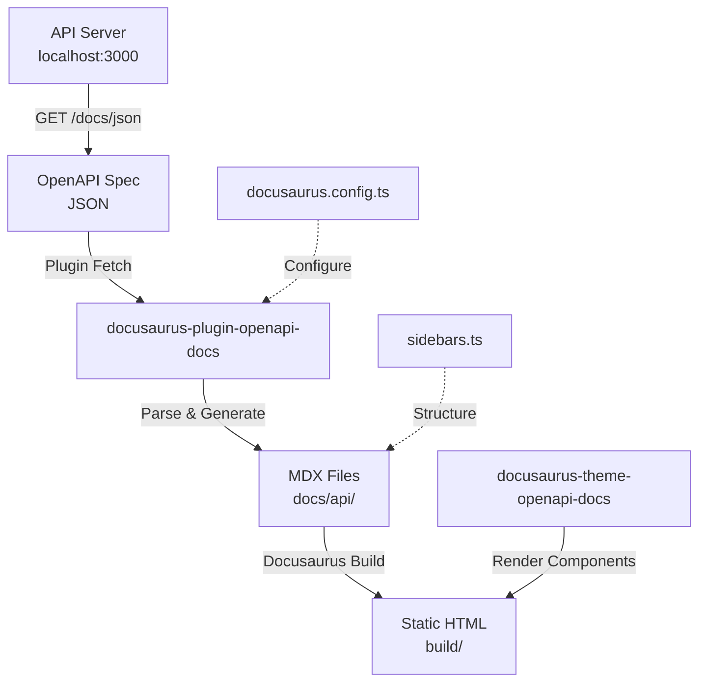
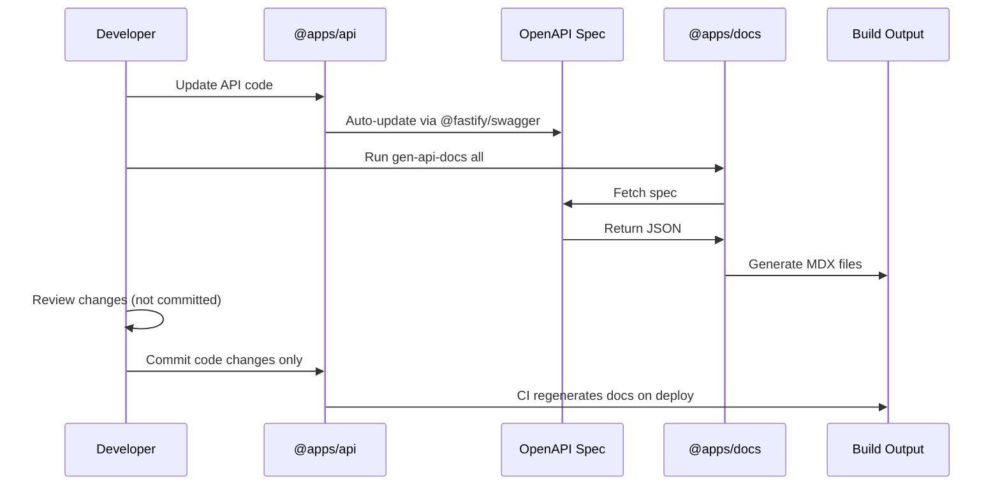
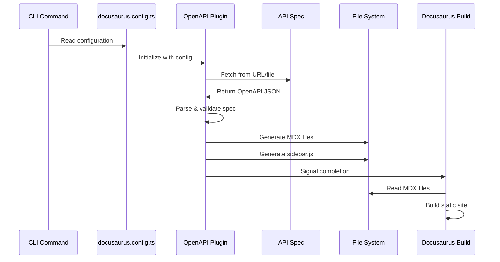
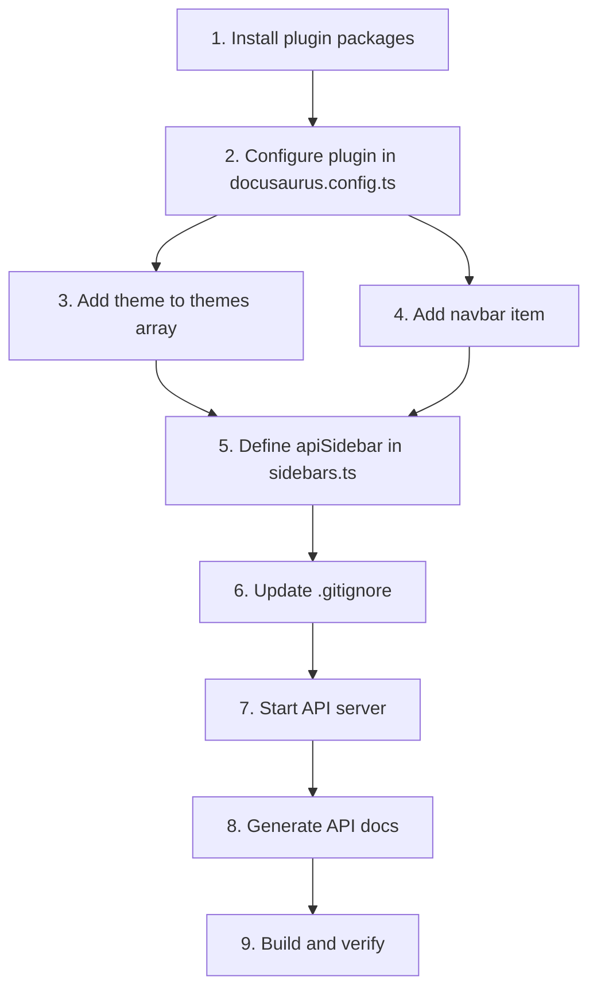

# OpenAPI Documentation Technical Design

## Overview

**Architecture Type**: Build-time Plugin Integration

This is a documentation integration feature that uses Docusaurus plugins to generate static API documentation at build time. Unlike traditional backend features, this does NOT follow the Router→Service→Repository pattern. Instead, it integrates third-party plugins into the Docusaurus build pipeline to auto-generate API documentation from OpenAPI specifications.

**Key Characteristics:**
- No backend services or database required
- Purely static documentation generation
- Build-time plugin execution
- Integration with existing Docusaurus infrastructure

## Key Design Decisions

1. **Use docusaurus-plugin-openapi-docs v4+ for Docusaurus 3 compatibility**
   - Ensures plugin works with current Docusaurus version
   - Provides latest features and security updates

2. **Fetch spec from running API server during development, with option for static file in CI/CD**
   - Development: Live fetch from `http://localhost:3000/docs/json` keeps docs in sync
   - CI/CD: Static file export eliminates runtime dependency

3. **Generate MDX files to docs/api/ directory (gitignored)**
   - Prevents merge conflicts from generated files
   - Ensures docs are always regenerated from source of truth
   - Reduces repository size

4. **Auto-generate sidebar items from OpenAPI paths**
   - Eliminates manual sidebar maintenance
   - Ensures documentation structure matches API organization
   - Groups endpoints by OpenAPI tags

5. **Inherit existing Docusaurus theme for visual consistency**
   - Seamless integration with existing documentation
   - Consistent user experience across all docs
   - Minimal custom styling required

## Plugin Architecture



### Component Responsibilities

| Component | Responsibility | Location |
|-----------|----------------|----------|
| **docusaurus-plugin-openapi-docs** | Fetches OpenAPI spec, parses it, generates MDX documentation files | npm package |
| **docusaurus-theme-openapi-docs** | Provides React components and styling for API documentation pages | npm package |
| **docusaurus.config.ts** | Configures spec source URL, output paths, sidebar generation options | `apps/docs/` |
| **sidebars.ts** | Defines navigation structure including API docs section | `apps/docs/` |
| **Docusaurus build process** | Compiles MDX files into static HTML with interactive components | Docusaurus core |

## Plugin Configuration

### Required Packages

```json
{
  "dependencies": {
    "docusaurus-plugin-openapi-docs": "^4.0.0",
    "docusaurus-theme-openapi-docs": "^4.0.0"
  }
}
```

**Installation:**
```bash
cd apps/docs
bun add docusaurus-plugin-openapi-docs docusaurus-theme-openapi-docs
```

**Peer Dependencies** (should already be installed):
- `@docusaurus/core@^3`
- `@docusaurus/preset-classic@^3`
- `react@^19`
- `react-dom@^19`

**Version Compatibility:** Plugin versions must match Docusaurus major version (v4.x for Docusaurus 3.x)

### Docusaurus Configuration

**File:** `apps/docs/docusaurus.config.ts`

#### 1. Add Type Import

```typescript
import type * as OpenApiPlugin from 'docusaurus-plugin-openapi-docs';
```

#### 2. Configure Plugin in Plugins Array

```typescript
plugins: [
  [
    'docusaurus-plugin-openapi-docs',
    {
      id: 'ledger-api',
      docsPluginId: 'default',
      config: {
        ledgerApi: {
          specPath: 'http://localhost:3000/docs/json',
          outputDir: 'docs/api',
          sidebarOptions: {
            groupPathsBy: 'tag',
            categoryLinkSource: 'tag',
          },
        },
      },
    },
  ],
]
```

**Configuration Options Explained:**
- `id`: Unique identifier for this plugin instance
- `docsPluginId`: ID of the docs plugin to integrate with (usually 'default')
- `specPath`: URL or file path to OpenAPI specification
- `outputDir`: Directory where MDX files will be generated
- `sidebarOptions.groupPathsBy`: Organize endpoints by OpenAPI 'tag' field
- `sidebarOptions.categoryLinkSource`: Use tag as category link

#### 3. Add Theme to Themes Array

```typescript
themes: ['docusaurus-theme-openapi-docs']
```

#### 4. Add Navbar Item

```typescript
themeConfig: {
  navbar: {
    items: [
      // ... existing items ...
      {
        type: 'docSidebar',
        sidebarId: 'apiSidebar',
        position: 'left',
        label: 'API Reference',
      },
    ],
  },
}
```

### Sidebar Configuration

**File:** `apps/docs/sidebars.ts`

```typescript
import type { SidebarsConfig } from '@docusaurus/plugin-content-docs';

const sidebars: SidebarsConfig = {
  tutorialSidebar: [
    // ... existing sidebar ...
  ],
  apiSidebar: [
    {
      type: 'autogenerated',
      dirName: 'api',
    },
  ],
};

export default sidebars;
```

**How it works:**
- `apiSidebar`: New sidebar specifically for API documentation
- `type: 'autogenerated'`: Automatically generates sidebar from directory structure
- `dirName: 'api'`: Points to the `docs/api/` directory where MDX files are generated

**Alternative Approach:**
```typescript
apiSidebar: require.resolve('docusaurus-plugin-openapi-docs/sidebars')
```
This uses the plugin's auto-generated sidebar directly (may require additional configuration).

## File Modifications

### 1. apps/docs/package.json

**Changes:**

```json
{
  "dependencies": {
    "docusaurus-plugin-openapi-docs": "^4.0.0",
    "docusaurus-theme-openapi-docs": "^4.0.0"
  },
  "scripts": {
    "gen-api-docs": "docusaurus gen-api-docs",
    "clean-api-docs": "docusaurus clean-api-docs"
  }
}
```

**Rationale:**
- Dependencies: Required for OpenAPI documentation generation and rendering
- Scripts: Convenience commands for generating and cleaning API documentation

**Action:** Add the dependencies and scripts to the existing `package.json` file.

### 2. apps/docs/docusaurus.config.ts

**Changes:**

1. **Add import at top of file:**
   ```typescript
   import type * as OpenApiPlugin from 'docusaurus-plugin-openapi-docs';
   ```

2. **Add/modify `plugins` array in config object:**
   ```typescript
   plugins: [
     [
       'docusaurus-plugin-openapi-docs',
       {
         id: 'ledger-api',
         docsPluginId: 'default',
         config: {
           ledgerApi: {
             specPath: 'http://localhost:3000/docs/json',
             outputDir: 'docs/api',
             sidebarOptions: {
               groupPathsBy: 'tag',
               categoryLinkSource: 'tag',
             },
           },
         },
       },
     ],
   ]
   ```
   - If `plugins` array doesn't exist, create it
   - If it exists, add the plugin configuration to the array

3. **Add/modify `themes` array in config object:**
   ```typescript
   themes: ['docusaurus-theme-openapi-docs']
   ```
   - If `themes` array doesn't exist, create it
   - If it exists, add the theme to the array

4. **Add navbar item to `themeConfig.navbar.items` array:**
   ```typescript
   {
     type: 'docSidebar',
     sidebarId: 'apiSidebar',
     position: 'left',
     label: 'API Reference',
   }
   ```
   - Insert after existing 'Docs' item or at end of navbar items

**Rationale:**
- Plugin configuration: Sets up spec fetching and MDX generation
- Theme: Enables API-specific rendering components
- Navbar: Provides user access to API documentation

### 3. apps/docs/sidebars.ts

**Changes:**

Add `apiSidebar` to the sidebars configuration object:

```typescript
const sidebars: SidebarsConfig = {
  tutorialSidebar: [
    // ... existing configuration ...
  ],
  apiSidebar: [
    {
      type: 'autogenerated',
      dirName: 'api',
    },
  ],
};
```

**Rationale:**
- Creates dedicated sidebar for API documentation
- Auto-generates structure from generated MDX files
- Keeps API docs separate from tutorial/guide docs

### 4. .gitignore (root)

**Changes:**

Add to the file:
```
# Generated API documentation
apps/docs/docs/api/
```

**Rationale:**
- Generated files should not be committed to version control
- Prevents merge conflicts
- Reduces repository size
- Ensures docs are always regenerated from source of truth

**Note:** Existing pattern `apps/*/.docusaurus/` may already cover some generated files, but this explicit entry improves clarity.

## Build Process and CLI Commands

### Installation

```bash
cd apps/docs
bun install
```

**Purpose:** Install OpenAPI plugin dependencies after modifying `package.json`

**When to run:** After modifying `package.json` dependencies

### Start API Server

```bash
cd apps/api
bun run dev
```

**Purpose:** Start API server to expose OpenAPI spec at `http://localhost:3000/docs/json`

**Required:** Before generating docs (in development workflow)

**Verification:**
```bash
curl http://localhost:3000/docs/json
```
Should return OpenAPI spec JSON

### Generate API Documentation

```bash
cd apps/docs
bun run gen-api-docs all
```

**Purpose:** Fetch OpenAPI spec and generate MDX documentation files

**Output:** Creates MDX files in `apps/docs/docs/api/` directory

**When to run:**
- After starting API server
- When API spec changes
- Before building docs

**What happens:**
1. Plugin fetches spec from configured URL
2. Parses OpenAPI structure (paths, tags, schemas)
3. Generates MDX file for each endpoint
4. Creates sidebar structure based on tags
5. Outputs files to `docs/api/` directory

### Build Documentation Site

```bash
cd apps/docs
bun run build
```

**Purpose:** Build static documentation site including API docs

**Output:** Static site in `apps/docs/build/` directory

**Prerequisites:** API docs must be generated first

### Serve Built Documentation

```bash
cd apps/docs
bun run serve
```

**Purpose:** Serve built documentation site for testing

**Access:** `http://localhost:3000` (or configured port)

**When to run:** After build to verify output before deployment

### Clean API Documentation

```bash
cd apps/docs
bun run clean-api-docs
```

**Purpose:** Remove generated API documentation files

**When to run:** When switching spec sources or troubleshooting generation issues

## Development Workflows

### Local Development Workflow

**Recommended Terminal Setup:**

**Terminal 1 - API Server:**
```bash
cd apps/api
bun run dev
```

**Terminal 2 - Docs Development:**
```bash
cd apps/docs

# Initial setup
bun run gen-api-docs all

# Start dev server
bun run start
```

**Access:** `http://localhost:3000/docs/api/`

**When API changes:**
```bash
# In Terminal 2
bun run gen-api-docs all
```
Then refresh browser to see updated docs.

### CI/CD Pipeline Workflow

#### Option A: Temporary API Server (Simple but slower)

```yaml
steps:
  - name: Checkout code
    run: git checkout

  - name: Install dependencies
    run: bun install

  - name: Start API server
    run: cd apps/api && bun run dev &

  - name: Wait for API
    run: |
      timeout 30 bash -c 'until curl -f http://localhost:3000/docs/json; do sleep 1; done'

  - name: Generate API docs
    run: cd apps/docs && bun run gen-api-docs all

  - name: Stop API server
    run: pkill -f 'bun run dev' || true

  - name: Build docs
    run: cd apps/docs && bun run build

  - name: Deploy
    run: # deployment command
```

#### Option B: Static Spec Export (Recommended - faster and more reliable)

**Implementation:**

1. **Create spec export script in `apps/api/scripts/export-spec.js`:**
   ```javascript
   const fs = require('fs');
   const http = require('http');

   // Start server, fetch spec, save to file, exit
   // (Implementation details in separate task)
   ```

2. **Add script to `apps/api/package.json`:**
   ```json
   {
     "scripts": {
       "export-spec": "node scripts/export-spec.js"
     }
   }
   ```

3. **Update plugin config to use static file:**
   ```typescript
   // In docusaurus.config.ts
   specPath: '../api/static/openapi.json'
   ```

4. **CI/CD Pipeline:**
   ```yaml
   steps:
     - name: Checkout code
       run: git checkout

     - name: Install dependencies
       run: bun install

     - name: Export OpenAPI spec
       run: cd apps/api && bun run export-spec

     - name: Generate API docs
       run: cd apps/docs && bun run gen-api-docs all

     - name: Build docs
       run: cd apps/docs && bun run build

     - name: Deploy
       run: # deployment command
   ```

**Advantages of Option B:**
- No need to run server in CI
- Faster builds (no server startup time)
- More reliable (no race conditions)
- Works in any environment

### Spec Update Workflow



**Steps:**
1. Developer updates API code in `@apps/api`
2. API spec automatically updates via `@fastify/swagger` decorators
3. Developer runs: `cd apps/docs && bun run gen-api-docs all`
4. Generated docs reflect latest API changes
5. Developer reviews changes locally
6. Commit code changes only (not generated docs)
7. CI/CD regenerates docs on deployment

## Generated Output Structure

**Directory:** `apps/docs/docs/api/`

**File Structure Example:**
```
apps/docs/docs/api/
├── ledger-api.info.mdx           # API overview from spec info
├── accounts/                      # Category from OpenAPI tag
│   ├── create-account.api.mdx    # POST /accounts endpoint
│   ├── get-account.api.mdx       # GET /accounts/{id} endpoint
│   └── list-accounts.api.mdx     # GET /accounts endpoint
├── transactions/                  # Category from OpenAPI tag
│   ├── create-transaction.api.mdx
│   └── get-transaction.api.mdx
└── sidebar.js                     # Auto-generated sidebar structure
```

**File Format:** MDX (Markdown with JSX components)

**Git Status:** Should be gitignored (regenerated on each build)

**Notes:**
- Actual structure depends on OpenAPI spec tags and operations
- Each endpoint becomes a separate MDX file
- Categories created from OpenAPI tags
- Sidebar auto-generated from structure

## Integration Points

### Docusaurus Build Pipeline Integration

**Plugin Lifecycle:**



**Execution Sequence:**
1. Plugin reads config from `docusaurus.config.ts`
2. Plugin fetches OpenAPI spec from configured URL or file path
3. Plugin parses spec and validates OpenAPI 3.0+ format
4. Plugin generates MDX files for each endpoint in output directory
5. Plugin generates sidebar structure based on tags and operations
6. Docusaurus processes MDX files during standard build
7. Theme renders API documentation with interactive components
8. Static HTML generated with client-side interactivity

**When it runs:**
- Manually: `bun run gen-api-docs all`
- During build: Can be configured as pre-build hook (optional)

### API Spec Fetching

#### Primary Method: HTTP Request

**Configuration:**
```typescript
specPath: 'http://localhost:3000/docs/json'
```

**Details:**
- Protocol: HTTP GET
- URL: `http://localhost:3000/docs/json`
- Headers: No authentication required (local development)
- Response Format: `application/json` (OpenAPI 3.0.0 spec)
- Error Handling: Plugin fails with error if spec is unreachable or invalid

**Requirements:**
- API server must be running on `localhost:3000`
- Endpoint `/docs/json` must return valid OpenAPI 3.0.0+ spec
- Spec must be accessible from docs build environment

#### Alternative Method: Static File

**Configuration:**
```typescript
specPath: '../api/static/openapi.json'
```

**Details:**
- Type: File path (relative to docusaurus.config.ts)
- Format: Static JSON file containing OpenAPI spec
- Use Case: CI/CD environments where running API server is not feasible
- Maintenance: Requires export script to generate file

**Implementation:**
1. Create export script in `@apps/api` to save spec to file
2. Add script to package.json: `"export-spec": "node scripts/export-spec.js"`
3. Run script before generating docs: `bun run export-spec`
4. Update `specPath` in plugin config to point to static file

**Recommended:** Static file method for CI/CD, HTTP for local development

### Navigation Integration

#### Navbar

**Location:** Top navigation bar (left side)

**Configuration:**
```typescript
{
  type: 'docSidebar',
  sidebarId: 'apiSidebar',
  position: 'left',
  label: 'API Reference',
}
```

**Behavior:**
- Clicking navigates to API documentation section
- Activates `apiSidebar` in sidebar panel
- Independent from tutorial/guide navigation

#### Sidebar

**Type:** Auto-generated from OpenAPI spec

**Organization:**
- Grouped by OpenAPI tags (e.g., "Accounts", "Transactions")
- Each tag becomes a category
- Endpoints listed under their tag category
- Ordering follows OpenAPI spec tags array

**Example Structure:**
```
API Reference
├── Overview
├── Accounts
│   ├── Create Account
│   ├── Get Account
│   └── List Accounts
└── Transactions
    ├── Create Transaction
    └── Get Transaction
```

#### Routing

**Base Path:** `/docs/api/`

**Endpoint Paths:**
- Generated from `operationId` or path
- Format: Kebab-case from operation names
- Example: `/docs/api/accounts/create-account`

**URL Structure:**
```
/docs/api/                          # API overview
/docs/api/accounts/create-account   # Specific endpoint
/docs/api/transactions/list         # Another endpoint
```

### Theme Integration

#### Visual Consistency

**Inheritance:**
- Inherits Docusaurus theme (colors, fonts, layout)
- Matches existing documentation styling
- Consistent header, footer, and navigation

**Custom Components:**
- Plugin provides API-specific components:
  - Request/response panels
  - Schema viewers
  - Try-it-out functionality
  - Authentication displays

**CSS Customization (Optional):**
- Add custom styles in `apps/docs/src/css/custom.css`
- Target API-specific classes if needed
- Example:
  ```css
  .openapi-endpoint {
    /* Custom styling for API endpoints */
  }
  ```

#### Interactive Features

**Request Examples:**
- Auto-generated from OpenAPI `examples` field
- Multiple examples shown if defined in spec
- Syntax highlighting for JSON/XML

**Response Schemas:**
- Rendered from OpenAPI schema definitions
- Expandable/collapsible nested objects
- Type information and constraints displayed

**Try-it-out:**
- Interactive API testing directly from docs
- Requires CORS configuration on API server
- Users can input parameters and send requests
- Real responses displayed

**Authentication:**
- Displays auth requirements from OpenAPI security definitions
- Shows required headers/tokens
- Input fields for API keys/tokens (if try-it-out enabled)

## Validation and Testing

### Pre-Implementation Checks

| Check | Command | Expected Result | Action if Failed |
|-------|---------|-----------------|------------------|
| Verify Docusaurus version | `cat apps/docs/package.json \| grep '@docusaurus/core'` | `^3.x.x` | Upgrade Docusaurus to version 3 |
| Verify API server exposes spec | `curl http://localhost:3000/docs/json` | JSON object with `openapi: '3.0.0'` | Configure @fastify/swagger in API |
| Verify spec format | `curl http://localhost:3000/docs/json \| grep '"openapi"'` | `"openapi": "3.0.0"` or higher | Upgrade Fastify swagger plugin |
| Check Node.js version | `node --version` | `v18+` (recommended) | Upgrade Node.js |
| Check bun installation | `bun --version` | Any version | Install bun package manager |

### Post-Implementation Validation

| Test | Command | Expected Result | Action if Failed |
|------|---------|-----------------|------------------|
| Package installation | `ls node_modules/docusaurus-plugin-openapi-docs` | Directory exists with plugin files | Run `bun install` |
| API docs generation | `cd apps/docs && bun run gen-api-docs all` | MDX files created in `docs/api/` | Check API server is running and spec is accessible |
| Generated files structure | `ls apps/docs/docs/api/` | Directory contains `.mdx` files and `sidebar.js` | Review plugin configuration |
| Build success | `cd apps/docs && bun run build` | Build completes without errors, outputs to `build/` | Review build logs for errors |
| Documentation accessibility | `bun run serve` → visit `http://localhost:3000/docs/api/` | API documentation pages render with navigation | Check sidebar config and navbar items |
| Interactive features | Manual: Navigate to endpoint page | Request/response examples display, try-it-out works | Review OpenAPI spec examples and schemas |

### Acceptance Criteria Verification

| Criterion | Verification Method | Status |
|-----------|---------------------|--------|
| Auto-generated API documentation visible in docs site | Navigate to API section, confirm endpoints are listed and documented | Manual verification after implementation |
| Docs fetch latest spec from API server during build | Make API change, regenerate docs, confirm change appears | Manual verification after implementation |
| Integration with Docusaurus sidebar and theme | Verify API docs appear in navigation and match site styling | Manual verification after implementation |
| Documentation updates on rebuild without manual sync | Change API spec, run gen-api-docs, confirm auto-update | Manual verification after implementation |

### Testing Checklist

- [ ] Plugin packages installed successfully
- [ ] API server running and spec accessible at `/docs/json`
- [ ] `gen-api-docs` command generates MDX files
- [ ] Generated files in `docs/api/` directory
- [ ] Sidebar includes API documentation section
- [ ] Navbar shows "API Reference" link
- [ ] Build completes without errors
- [ ] API docs accessible at `/docs/api/` after build
- [ ] All endpoints appear in generated docs
- [ ] Navigation between endpoints works
- [ ] Request/response examples display correctly
- [ ] Try-it-out functionality works (if CORS configured)
- [ ] Visual styling matches rest of docs site

## Dependency Matrix

### External Dependencies

| Dependency | Type | Purpose | Coupling | Failure Impact |
|------------|------|---------|----------|----------------|
| **@apps/api** | Monorepo sibling application | Provides OpenAPI spec at runtime endpoint | Loose - only depends on spec endpoint availability | Cannot generate docs if API server not running or spec endpoint broken |
| **@fastify/swagger** | API framework plugin | Generates OpenAPI 3.0.0 spec from Fastify routes | Indirect - depends on spec format, not plugin directly | Invalid or incompatible spec format causes generation failures |
| **Docusaurus 3.x** | Documentation framework | Build system and plugin architecture | Direct - plugin designed for Docusaurus 3.x | Incompatible Docusaurus version prevents plugin usage |
| **docusaurus-plugin-openapi-docs** | npm package | Core plugin for parsing OpenAPI spec | Direct - required for feature | Cannot generate API docs without plugin |
| **docusaurus-theme-openapi-docs** | npm package | Theme components for rendering API docs | Direct - required for rendering | API docs won't render properly without theme |

### Internal Dependencies

| Component | Depends On | Reason |
|-----------|------------|--------|
| **docusaurus.config.ts** | Plugin packages installed | Config imports and references plugin |
| **sidebars.ts** | Generated docs in `docs/api/` | Auto-generated sidebar requires content directory |
| **navbar** | `apiSidebar` defined in sidebars.ts | Navbar links to sidebar by ID |
| **build process** | Generated MDX files | Docusaurus build processes MDX content |
| **API docs generation** | API server running (or static spec file) | Plugin fetches spec from source |

### Implementation Order



**Detailed Steps:**

1. **Install plugin packages** - `bun add docusaurus-plugin-openapi-docs docusaurus-theme-openapi-docs`
2. **Configure plugin in docusaurus.config.ts** - Add plugin to plugins array with spec URL and options
3. **Add theme to themes array** - Enable OpenAPI theme components
4. **Add navbar item** - Create "API Reference" navigation link
5. **Define apiSidebar in sidebars.ts** - Set up auto-generated sidebar
6. **Update .gitignore** - Exclude generated docs directory
7. **Start API server** - `cd apps/api && bun run dev`
8. **Generate API docs** - `cd apps/docs && bun run gen-api-docs all`
9. **Build and verify** - `bun run build && bun run serve`

## CI/CD Integration

### Build Pipeline Modifications

#### Option A: Temporary API Server (Simple)

**Pre-Build Step: Start API Server**
```yaml
- name: Start API Server
  run: cd apps/api && bun run dev &
```

**Wait for Server:**
```yaml
- name: Wait for API
  run: |
    timeout 30 bash -c 'until curl -f http://localhost:3000/docs/json; do sleep 1; done'
  timeout-minutes: 1
```

**Generate Docs:**
```yaml
- name: Generate OpenAPI Docs
  run: cd apps/docs && bun run gen-api-docs all
```

**Post-Build Step: Stop Server**
```yaml
- name: Stop API Server
  run: pkill -f 'bun run dev' || true
```

**Pros:** Simple, no code changes
**Cons:** Slower, potential race conditions, requires process management

#### Option B: Static Spec Export (Recommended)

**Implementation Steps:**

1. **Create export script: `apps/api/scripts/export-spec.js`**
   ```javascript
   // Pseudocode - detailed implementation in separate task
   // 1. Start server programmatically
   // 2. Fetch spec from localhost:3000/docs/json
   // 3. Write to static/openapi.json
   // 4. Stop server
   // 5. Exit
   ```

2. **Add script to `apps/api/package.json`:**
   ```json
   {
     "scripts": {
       "export-spec": "node scripts/export-spec.js"
     }
   }
   ```

3. **Update plugin config to use static file:**
   ```typescript
   // In docusaurus.config.ts
   config: {
     ledgerApi: {
       specPath: process.env.CI ? '../api/static/openapi.json' : 'http://localhost:3000/docs/json',
       // ... other options
     }
   }
   ```

4. **CI Pipeline:**
   ```yaml
   - name: Export OpenAPI Spec
     run: cd apps/api && bun run export-spec

   - name: Generate API Docs
     run: cd apps/docs && bun run gen-api-docs all

   - name: Build Docs
     run: cd apps/docs && bun run build
   ```

**Pros:**
- Faster builds (no server startup wait)
- More reliable (no race conditions)
- Works in any environment
- No background process management

**Cons:**
- Requires additional script
- Slight complexity in dual-mode config

**Recommendation:** Use Option B for production CI/CD

### Deployment Considerations

#### Static Site Hosting

**Compatible Platforms:**
- Vercel
- Netlify
- GitHub Pages
- AWS S3 + CloudFront
- Azure Static Web Apps
- Any static hosting service

**Build Output:** `apps/docs/build/`

**Environment Variables:** None required (build-time generation)

**Configuration:** Standard static site deployment - no special requirements

#### Caching Strategy

| Resource | Cache Strategy | Rationale |
|----------|----------------|-----------|
| Generated docs (`docs/api/`) | **Do not cache** | Regenerated on each deployment from source |
| node_modules | **Cache** | Speeds up builds significantly |
| .docusaurus/ | **Safe to cache** | Docusaurus internal cache directory |
| bun.lockb | **Cache** | Dependency lock file for consistent installs |

**Example GitHub Actions Cache:**
```yaml
- uses: actions/cache@v3
  with:
    path: |
      node_modules
      apps/docs/node_modules
      apps/api/node_modules
    key: ${{ runner.os }}-bun-${{ hashFiles('**/bun.lockb') }}
```

## Configuration Examples

### Complete docusaurus.config.ts

```typescript
import type { Config } from '@docusaurus/types';
import type * as Preset from '@docusaurus/preset-classic';
import type * as OpenApiPlugin from 'docusaurus-plugin-openapi-docs';

const config: Config = {
  title: 'Exchequer',
  tagline: 'Modern double-entry ledger API',
  favicon: 'img/favicon.ico',
  url: 'https://your-domain.com',
  baseUrl: '/',

  organizationName: 'your-org',
  projectName: 'exchequer',

  onBrokenLinks: 'throw',
  onBrokenMarkdownLinks: 'warn',

  i18n: {
    defaultLocale: 'en',
    locales: ['en'],
  },

  presets: [
    [
      'classic',
      {
        docs: {
          sidebarPath: './sidebars.ts',
          editUrl: 'https://github.com/your-org/exchequer/tree/main/apps/docs/',
        },
        blog: {
          showReadingTime: true,
        },
        theme: {
          customCss: './src/css/custom.css',
        },
      } satisfies Preset.Options,
    ],
  ],

  plugins: [
    [
      'docusaurus-plugin-openapi-docs',
      {
        id: 'ledger-api',
        docsPluginId: 'default',
        config: {
          ledgerApi: {
            specPath: 'http://localhost:3000/docs/json',
            outputDir: 'docs/api',
            sidebarOptions: {
              groupPathsBy: 'tag',
              categoryLinkSource: 'tag',
            },
          },
        },
      },
    ],
  ],

  themes: ['docusaurus-theme-openapi-docs'],

  themeConfig: {
    image: 'img/social-card.jpg',
    navbar: {
      title: 'Exchequer',
      logo: {
        alt: 'Exchequer Logo',
        src: 'img/logo.svg',
      },
      items: [
        {
          type: 'docSidebar',
          sidebarId: 'tutorialSidebar',
          position: 'left',
          label: 'Docs',
        },
        {
          type: 'docSidebar',
          sidebarId: 'apiSidebar',
          position: 'left',
          label: 'API Reference',
        },
        { to: '/blog', label: 'Blog', position: 'left' },
        {
          href: 'https://github.com/your-org/exchequer',
          label: 'GitHub',
          position: 'right',
        },
      ],
    },
    footer: {
      style: 'dark',
      links: [
        {
          title: 'Docs',
          items: [
            {
              label: 'Getting Started',
              to: '/docs/intro',
            },
            {
              label: 'API Reference',
              to: '/docs/api',
            },
          ],
        },
      ],
      copyright: `Copyright © ${new Date().getFullYear()} Your Organization. Built with Docusaurus.`,
    },
    prism: {
      theme: require('prism-react-renderer').themes.github,
      darkTheme: require('prism-react-renderer').themes.dracula,
    },
  } satisfies Preset.ThemeConfig,
};

export default config;
```

### Complete sidebars.ts

```typescript
import type { SidebarsConfig } from '@docusaurus/plugin-content-docs';

const sidebars: SidebarsConfig = {
  tutorialSidebar: [
    {
      type: 'category',
      label: 'Getting Started',
      items: ['intro', 'installation'],
    },
    {
      type: 'category',
      label: 'Core Concepts',
      items: ['concepts/ledger', 'concepts/accounts', 'concepts/transactions'],
    },
  ],

  apiSidebar: [
    {
      type: 'autogenerated',
      dirName: 'api',
    },
  ],
};

export default sidebars;
```

### Package.json Additions

```json
{
  "name": "@exchequer/docs",
  "version": "0.0.0",
  "private": true,
  "scripts": {
    "docusaurus": "docusaurus",
    "start": "docusaurus start",
    "dev": "docusaurus start",
    "build": "docusaurus build",
    "serve": "docusaurus serve",
    "gen-api-docs": "docusaurus gen-api-docs",
    "clean-api-docs": "docusaurus clean-api-docs",
    "clear": "docusaurus clear"
  },
  "dependencies": {
    "@docusaurus/core": "^3.0.0",
    "@docusaurus/preset-classic": "^3.0.0",
    "docusaurus-plugin-openapi-docs": "^4.0.0",
    "docusaurus-theme-openapi-docs": "^4.0.0",
    "react": "^19.0.0",
    "react-dom": "^19.0.0"
  },
  "devDependencies": {
    "@docusaurus/module-type-aliases": "^3.0.0",
    "@docusaurus/types": "^3.0.0"
  },
  "browserslist": {
    "production": [">0.5%", "not dead", "not op_mini all"],
    "development": ["last 1 chrome version", "last 1 firefox version", "last 1 safari version"]
  }
}
```

## Risk Mitigation

### Risk 1: API Server Dependency

**Risk:** Docs build fails if API server not running or unreachable

**Likelihood:** High in CI/CD environments

**Impact:** Build failures, deployment blocked

**Mitigation Strategies:**

1. **Primary: Static spec export script** (Recommended)
   - Create export script in `@apps/api`
   - Export spec to static JSON file before docs build
   - Update plugin config to use file path instead of URL
   - See "CI/CD Integration - Option B" above

2. **Secondary: Health check with retry logic**
   ```bash
   # Wait for API to be ready with timeout
   timeout 30 bash -c 'until curl -f http://localhost:3000/docs/json; do sleep 1; done'
   ```

3. **Tertiary: Cache last-known-good spec**
   - Save successful spec fetches to fallback file
   - Use fallback if live fetch fails
   - Requires custom plugin wrapper or pre-fetch script

**Recommended:** Implement static spec export (mitigation #1)

### Risk 2: Spec Version Compatibility

**Risk:** Plugin requires OpenAPI 3.0+ but API generates Swagger 2.0

**Likelihood:** Low (Fastify @fastify/swagger generates OpenAPI 3.0 by default)

**Impact:** Plugin fails to parse spec, no docs generated

**Mitigation Strategies:**

1. **Verify spec version before implementation**
   ```bash
   curl localhost:3000/docs/json | jq '.openapi'
   # Should return: "3.0.0" or higher
   ```

2. **Configure @fastify/swagger for OpenAPI 3.0**
   ```javascript
   // In API server
   await app.register(require('@fastify/swagger'), {
     openapi: {
       openapi: '3.0.0',
       // ... other config
     }
   });
   ```

3. **Add spec validation in CI**
   ```yaml
   - name: Validate OpenAPI Version
     run: |
       VERSION=$(curl localhost:3000/docs/json | jq -r '.openapi')
       [[ "$VERSION" =~ ^3\. ]] || exit 1
   ```

**Validation Command:**
```bash
curl localhost:3000/docs/json | jq '.openapi'
```
Expected: `"3.0.0"` or higher

### Risk 3: Generated File Commits

**Risk:** Developers commit generated docs causing merge conflicts and repo bloat

**Likelihood:** Medium without proper gitignore

**Impact:** Merge conflicts, repository bloat, confusion about source of truth

**Mitigation Strategies:**

1. **Add to .gitignore** (Required)
   ```
   apps/docs/docs/api/
   ```

2. **Document in README**
   ```markdown
   ## API Documentation

   API docs are auto-generated from OpenAPI spec.
   DO NOT manually edit files in `apps/docs/docs/api/`.
   Run `bun run gen-api-docs all` to regenerate.
   ```

3. **Pre-commit hook** (Optional)
   ```bash
   # .husky/pre-commit
   if git diff --cached --name-only | grep -q "apps/docs/docs/api/"; then
     echo "Error: Cannot commit generated API docs"
     exit 1
   fi
   ```

### Risk 4: Plugin Compatibility

**Risk:** Plugin incompatible with Docusaurus 3.x

**Likelihood:** Low (plugin actively maintained for Docusaurus 3)

**Impact:** Build errors, need alternative solution

**Mitigation Strategies:**

1. **Verify compatibility before implementation**
   - Check plugin GitHub: https://github.com/PaloAltoNetworks/docusaurus-openapi-docs
   - Review releases for Docusaurus 3 support
   - Check issues for compatibility problems

2. **Test in isolated environment**
   - Create test branch
   - Install plugin and test build
   - Verify before applying to main branch

3. **Fallback plan**
   - Manual API docs (not ideal)
   - Alternative plugin: `docusaurus-plugin-redoc`
   - Custom MDX generation script

**Verification:**
- Plugin v4.x is designed for Docusaurus 3.x
- Check releases: https://github.com/PaloAltoNetworks/docusaurus-openapi-docs/releases

## Future Enhancements (Out of Scope)

### Potential Improvements

1. **Multiple API Versions**
   - Description: Support v1, v2 API documentation with version switcher
   - Implementation: Configure multiple plugin instances with different specPath values
   - Complexity: Medium - requires versioned API specs and navigation changes
   - Example:
     ```typescript
     config: {
       v1: { specPath: 'http://localhost:3000/v1/docs/json', outputDir: 'docs/api/v1' },
       v2: { specPath: 'http://localhost:3000/v2/docs/json', outputDir: 'docs/api/v2' },
     }
     ```

2. **Live API Testing with Authentication**
   - Description: Try-it-out feature with real auth tokens
   - Implementation: Configure CORS on API, add auth token input in theme
   - Complexity: Medium - requires security considerations
   - Security: Must not expose sensitive tokens in logs/screenshots

3. **Custom Examples and Tutorials**
   - Description: Supplement auto-generated docs with manual guides
   - Implementation: Add manual MDX files alongside generated ones
   - Complexity: Low - standard Docusaurus content authoring
   - Example: Create `apps/docs/docs/api/guides/getting-started.md`

4. **API Changelog**
   - Description: Track and display API changes over time
   - Implementation: Diff spec versions, generate changelog
   - Complexity: High - requires custom tooling and spec version tracking
   - Tools: `oasdiff`, custom script to compare specs

### Explicitly Not in Scope

- API versioning (v1, v2) - requires API changes
- Custom API playground/editor - complex interactive feature
- Real-time API testing with live data - security and infrastructure concerns
- API analytics or usage tracking - separate analytics feature
- Custom spec generation - relies on @fastify/swagger

---

## Implementation Summary

**This design document provides:**
- Complete configuration specifications for all modified files
- Step-by-step build process and CLI commands
- Integration points with Docusaurus and API server
- Comprehensive validation and testing procedures
- CI/CD pipeline modifications with two approaches
- Risk mitigation strategies for common issues
- Clear implementation order and dependencies

**Next Steps:**
1. Review this design with team
2. Create implementation tasks following the dependency matrix order
3. Follow the detailed file modifications and configuration examples
4. Validate each step using the testing checklist
5. Deploy using recommended CI/CD approach (static spec export)

**Estimated Implementation Time:** 2-3 hours
- Configuration: 1 hour
- Testing and validation: 1 hour
- CI/CD integration: 30-60 minutes (depending on approach)

**Key Success Criteria:**
- API documentation visible at `/docs/api/`
- Docs automatically update when spec changes
- Seamless integration with existing Docusaurus site
- No manual sync required between API and docs
